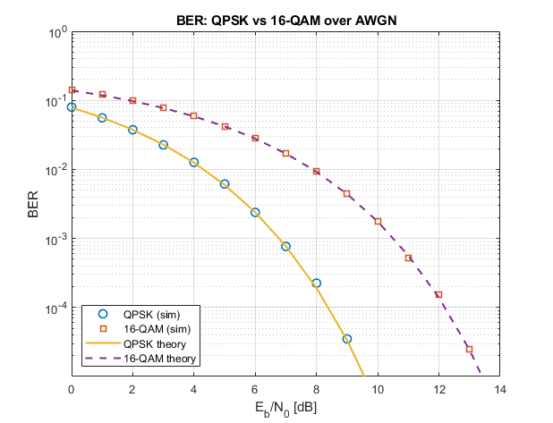

# Digital Modulation and Bit-Error-Rate Characterisation

BPSK, QPSK, 16-QAM and π/4-DQPSK modulator and demodulator chains implemented
from first principles in MATLAB - no library modulation functions - with bit
error probability estimated by Monte Carlo and validated against closed-form
theoretical bounds.



## The result

Simulated error rates track the closed-form Gaussian tail bounds across the
whole waterfall region, swept over 0–14 dB Eb/N0 at 10⁵ symbols per operating
point.

The 16-QAM energy penalty was predicted analytically before it was measured.
The QPSK constellation sits at ±1 ± j, giving a minimum distance of 2; the
16-QAM grid has level spacing 2d = 2√0.4 = 1.265 under the same energy
constraint. Detection error scales with d²min, so the expected separation is

```
10·log10(4 / 1.6) = 10·log10(2.5) = 3.98 dB
```

At a target BER of 10⁻⁴ the simulation needs **8.4 dB** for QPSK and **12.2 dB**
for 16-QAM - a measured separation of **3.8 dB**. The small shortfall from 3.98
is the ¾ prefactor in the square-QAM expression and the larger nearest-neighbour
count each interior 16-QAM symbol must be distinguished from.

That is the whole point of the project: 16-QAM doubles spectral efficiency from
1 to 2 bit/s/Hz, and it pays 3.8 dB in signal-to-noise ratio for it. The
trade-off is not a rule of thumb here - it is derived, then measured, and the
two agree.

## What is implemented

| Scheme | Bits/symbol | Detection | Rs at Rb = 1 Mbit/s | Null-to-null BW | Spectral efficiency |
|---|---|---|---|---|---|
| BPSK | 1 | Coherent | 1 MHz | 2 MHz | 0.5 bit/s/Hz |
| QPSK | 2 | Coherent | 500 kHz | 1.0 MHz | 1 bit/s/Hz |
| 16-QAM | 4 | Coherent | 250 kHz | 0.5 MHz | 2 bit/s/Hz |
| π/4-DQPSK | 2 | Differential | 500 kHz | 1.0 MHz | 1 bit/s/Hz |

Both coherent constellations are products of two independent PAM sets, so the
energy normalisation and the Gray mapping factorise over the I and Q axes, and
optimum detection reduces to independent threshold detection on the real and
imaginary parts of the matched-filter output. 16-QAM is two quadrature 4-PAM
channels; its per-axis levels and its ±2d = ±1.265 thresholds fall straight out
of that.

Constellation mapping, Gray coding, decision regions and the differential
phase mapping are written out by hand in [`src/`](src/) - all four schemes are
dispatched from a single `Mapper`/`DeMapper` pair on a `ModType` argument.
Nothing in this repository calls `pskmod`, `qammod`, `comm.QPSKModulator` or any
equivalent.

### π/4-DQPSK

Data is carried in the phase *transition* rather than the absolute phase, with
Gray-coded transitions of ±π/4 and ±3π/4. Because no transition is 180°, the
signal trajectory never crosses the origin, which keeps the envelope closer to
constant and is easier on a non-linear power amplifier. The transmitted
sequence traces an 8-point star - even-indexed symbols land on the axes,
odd-indexed on the diagonals - despite there being only four data states.

Demodulation is `z_n = y_n · conj(y_{n-1})`: a static channel phase θ appears in
both terms and cancels exactly, so the receiver needs no carrier recovery loop
and tolerates an arbitrary constant offset. That is the entire reason to accept
the ~3 dB energy penalty differential detection costs against coherent QPSK.

**The detector originally submitted did not do this**, and its BER curve was
flat at ~6% instead of falling. It quantised each symbol to an absolute 8-PSK
grid before differencing, which is coherent detection wearing a differential
coat. Every functional test passed anyway, because all three phase offsets
tested happened to fall inside the region where the two are indistinguishable.
The diagnosis, the six-line fix, and the verification against the closed-form
DQPSK bound are written up in
[docs/dqpsk-detector-fix.md](docs/dqpsk-detector-fix.md). `src/` carries the
corrected detector; the write-up is kept because the failure is more
instructive than the working code around it.

## Requirements

MATLAB R2020b or later. The modulation is toolbox-free, but the surrounding
harness is not: `AWGN.m` wraps MATLAB's `awgn`, and the scripts use `de2bi`,
`bi2de`, `qfunc` and `scatterplot` from the Communications Toolbox and `pwelch`
from the Signal Processing Toolbox. Replacing those is on the list below.

## Reproducing the figures

```matlab
addpath('src', 'framework', 'scripts');
run_ber_sweep          % figures/ber_qpsk_16qam.png
run_dqpsk              % figures/ber_qpsk_vs_dqpsk.png, phase-offset sweep
plot_psd_compare       % figures/psd_qpsk_16qam.png
plot_constellations    % ideal constellations with Gray labels and boundaries
test_noiseless         % modulator/demodulator back to back, expect BER = 0
```

Sweep parameters - Eb/N0 range, symbols per point, samples per symbol - are at
the top of `run_ber_sweep.m`. The full sweep takes a few minutes; reduce the
symbol count for a faster, noisier version.

The random seed is derived from the group's student IDs, so the figures
regenerate bit-for-bit.

## Scope and attribution

This repository covers the **modulation and demodulation half** of a two-part
university project, which is the half I worked on, co-authored with a project
partner. The channel-coding half - Hamming and repetition codes, coding gain,
and the integrated coded 16-QAM link - was done by two other group members, is
not included here, and is not mine to publish. The `ChannelEncoder.m` and
`ChannelDecoder.m` files present in this repository are reduced to the
pass-through (`'NONE'`) path; their coded branches were written by those group
members and have been stripped, not published. They are here only because the
transmit chain calls them.

Several files under [`framework/`](framework/) are course-provided scaffolding
that I did not write. [NOTICE.md](NOTICE.md) states file by file what is mine,
what is a partner's, and what came with the assignment. The MIT licence applies
to my own contributions.

## What I would change

The BER estimator uses a fixed symbol count per operating point. That wastes
time at low Eb/N0 where errors are plentiful, and at the top of the sweep 10⁵
symbols is simply not enough to resolve the tail - with 4×10⁵ bits the smallest
measurable QPSK error rate is around 10⁻⁵, which is why the simulated markers
stop short of the theoretical curve past 9 dB. An adaptive stopping rule - run
until a target number of *errors* is observed rather than a target number of
symbols - would give tighter confidence at the tail for the same total runtime.

The noise generator is seeded with the same constant on every call, so the same
underlying realisation is reused at every operating point. Reproducibility is
worth keeping, but drawing a fresh substream per point would make the sweep
points statistically independent and the confidence intervals honest.

The DQPSK test set needs widening, not just the detector fixing. Three static
phase offsets were tried and all three sat inside the band where a broken
detector and a correct one agree; the offset the framework itself suggested
would have caught it on the first run. Sweeping the offset continuously rather
than sampling three convenient values is a one-line change and would have made
the bug unmissable.

The pulse shaping is a rectangular moving average, which is not Nyquist and
leaves residual ISI. A root-raised-cosine pulse with a matched receive filter,
plus a timing recovery loop, would make the differential-versus-coherent
comparison fair - resistance to timing and phase error is most of the reason to
choose DQPSK, and assuming perfect symbol timing gives away the comparison.

Finally, the toolbox dependencies listed above are avoidable. `awgn`, `qfunc`
and the binary conversion helpers are each a few lines, and removing them would
let the whole repository run on GNU Octave.

## Licence

MIT - see [LICENSE](LICENSE) and the scope note in [NOTICE.md](NOTICE.md).
